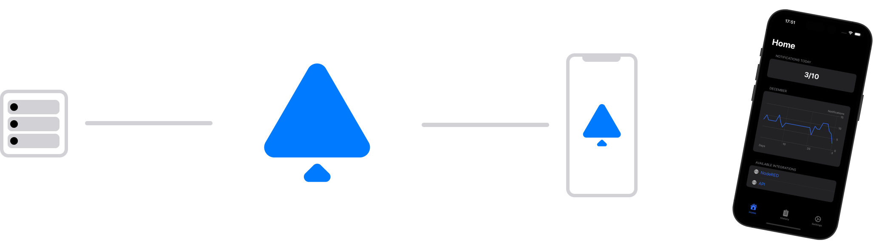

# Node RED PushBell Node

[](https://www.npmjs.com/package/node-red-contrib-pushbell)
[](https://www.npmjs.com/package/node-red-contrib-pushbell)
[](https://github.com/MariusLang/node-red-contrib-pushbell/issues)

[](https://nodei.co/npm/node-red-contrib-pushbell/)

The Node RED **PushBell** node allows you to create notifications in Node RED, which can be sent to your iPhone.

## Installation

```
npm install node-red-contrib-pushbell
```

## Quick Start

1. PushBell app setup
    1. Download the PushBell app from the [App Store](https://apps.apple.com/de/app/pushbell/id6474076842)
    2. Create an PushBell account in the app
    3. Follow the instructions in the app to generate an API key
2. Node RED PushBell node setup
    1. Import [this example](#example) in Node RED
    2. Change the node configuration, especially the API key
    3. Send [this](#node-input) payload to the input of the node. You can adjust the title and description as needed to
       align with your purpose.
    4. If everything was successful the [node status](#node-status) should turn to `sending` and after a few seconds
       to `200 Notification successfully created`.

## Getting Started

### PushBell app setup

If you already have an PushBell account, all you need to do is sign in. You can locate your existing API keys under the
*Settings > Manage API keys* section. Otherwise, please follow the instructions below.

To get started, download the PushBell app from the App Store. After installation, go ahead and create your own PushBell
account. To create an API key, just follow the instructions given or go to *Settings > Manage API keys* and select
**Generate API key**. Before that, you need to pick an appropriate name for the API key. The name you choose is up
to you. It's simply helpful for you to identify your API keys at a later time.

### PushBell Node RED setup

Then switch to Node RED and [install](#installation) the **node-red-contrib-pushbell** node. When the installation is
completed, you need to initialize the node by using your API key. To do this, create a PushBell configuration node and
initialize it with your API key. In the configuration node, you can also choose a name for the API key. The name you
choose is up to you. It's simply necessary for you to identify your API key configuration nodes at a later time.

To create notifications send [this](#node-input) payload to the node's input.

## Node Input

```javascript
msg.payload = {
  title: "My Notification Title",
  description: "My Notification Description"
}
```

## Node Status

### Green

If you see a green dot and a message that says `200 Notification successfully created`, it means everything went
smoothly. Your notification has been sent to the PushBell server and the smartphones connected to your account.

### Blue

If you see a blue ring and a message that says `sending`, it means that the node-red-contrib-pushbell node is attempting
to create a notification. In a few seconds, this status should change to either [red](#red) or [green](#green).

### Red

If you see a red dot, it indicates an error occurred while creating a notification. To obtain more information,
refer to the message provided next to the status badge.

Common errors status codes are:

- `401 Unauthorized` - Something went wrong with the authorization process. Please check your API key configuration and
  try again.
- `429 Requests exceeded for today` - The number of notifications you can send per day is limited. It seems that this
  limit has been exceeded. For more information, please refer to the information provided in the PushBell app.
- `400 Bad Request` - Check the payload you sent to the node-red-contrib-pushbell node. It appears that there may be
  something wrong with your input body. In the section [Node Input](#node-input) you will find additional information on
  how your input payload should be formatted.
- `500 Request failed` - If you come across this error, please check your node configuration and attempt to create a
  notification again. If you encounter this error once more, feel free to contact us.

## Example

### Example with inject node

```
[{"id":"fb6722ac587b6597","type":"pushbell","z":"3da09f0d7844dad0","name":"PushBell","config":"9da5db230813bb17","x":540,"y":200,"wires":[]},{"id":"2ffbc301bddb43ce","type":"inject","z":"3da09f0d7844dad0","name":"msg.payload","props":[{"p":"payload.name","v":"Test Title","vt":"str"},{"p":"payload.description","v":"Test Description","vt":"str"}],"repeat":"","crontab":"","once":false,"onceDelay":0.1,"topic":"","x":390,"y":200,"wires":[["fb6722ac587b6597"]]},{"id":"9da5db230813bb17","type":"pushbell-config","name":"My API Key","apiKey":"replace with your API key"}]
```

### Example with function node

```
[{"id":"0780a9a59135a8e0","type":"function","z":"3da09f0d7844dad0","name":"msg.payload","func":"msg.payload = {\n    title: \"My Notification Title\",\n    description: \"My Notification Description\"\n}\n\nreturn msg;","outputs":1,"timeout":0,"noerr":0,"initialize":"","finalize":"","libs":[],"x":430,"y":260,"wires":[["43ae6e86ca849bf9"]]},{"id":"6af1a75b88ad0e01","type":"inject","z":"3da09f0d7844dad0","name":"inject","props":[{"p":"payload"},{"p":"topic","vt":"str"}],"repeat":"","crontab":"","once":false,"onceDelay":0.1,"topic":"","payload":"","payloadType":"date","x":290,"y":260,"wires":[["0780a9a59135a8e0"]]},{"id":"43ae6e86ca849bf9","type":"pushbell","z":"3da09f0d7844dad0","name":"PushBell","config":"9da5db230813bb17","x":580,"y":260,"wires":[]},{"id":"9da5db230813bb17","type":"pushbell-config","name":"My API Key","apiKey":"replace with your API key"}]
```
