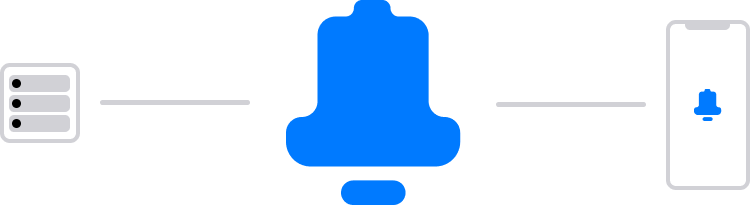

# Node RED PushBell Node

[](https://www.npmjs.com/package/node-red-contrib-pushbell)
[](https://www.npmjs.com/package/node-red-contrib-pushbell)
[](https://github.com/MariusLang/node-red-contrib-pushbell/issues)

[](https://nodei.co/npm/node-red-contrib-pushbell/)

The Node RED **PushBell** node you can easily create notifications in Node RED and send them to your iPhone.

## Installation

```
npm install node-red-contrib-pushbell
```

## Quick Start

1. Import [this example](#example)
2. Change the node configuration, especially the API key
3. Send [this](#node-input) payload to the node's input
4. If everything was successful the [node status](#node-status) should turn to ***sending*** and after a few seconds to
   ***200 Notification successfully created***

## Getting Started

To get started, download the PushBell app from the App Store. After installation, go ahead and create your own PushBell
account.

Then initialize the node-red-contrib-pushbell node with your API key. Therefore, create a configuration node and
initialize it with your API key.

To create notifications send [this](#node-input) payload to the node's input.

## Node Input

```javascript
msg.payload = {
  title: "My Notification Title",
  description: "My Notification Description"
}
```

## Node Status

### Green

If you see a green dot and a message that says `200 Notification successfully created`, it means everything went
smoothly. Your notification has been sent to the PushBell server and the smartphones connected to your account.

### Blue

If you see a blue ring and a message that says `sending`, it means that the node-red-contrib-pushbell node is attempting
to create a notification. In a few seconds, this status should change to either [red](#red) or [green](#green).

### Red

If you encounter a red dot, it indicates an error occurred while creating a notification. To obtain more information,
refer to the message provided next to the status badge.

Common errors are:

- `401 Unauthorized` - Something went wrong with the authorization process. Please check your API key configuration and
  try again.
- `429 Requests exceeded for today` - The number of notifications you can send per day is limited. It seems that this
  limit has been exceeded. For more information, please refer to the information provided in the PushBell app.
- `400 Bad Request` - Check the payload you send to the node-red-contrib-pushbell node. It appears that there may be
  something wrong with your input body. In the section [Node Input](#node-input) you will find additional information on
  how your input payload should be formatted.
- `500 Request failed` - If you come across this error, please check your node configuration and attempt to create a
  notification again. If you encounter this error once more, feel free to reach out to us.

## Example

```
EXAMPLE
```
